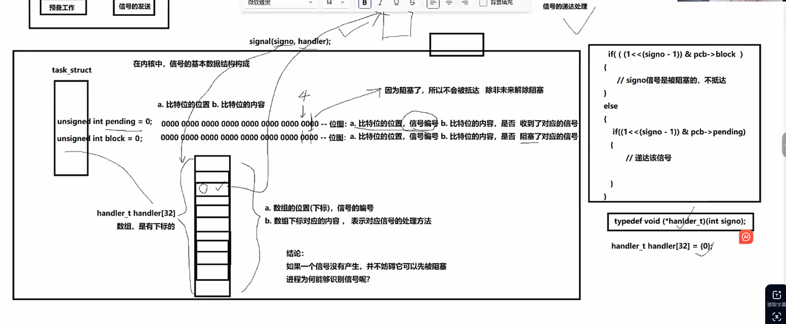

- 进程间通信有SystemV 标准这种，它包含了共享内存，消息队列，信号量 


- 信号和信号量没有关系
## 信号


- 信号产生
- 信号保存
- 信号处理
----

- kill -l
- (1,31):普通信号
- (34,64):实时信号


- ctrl+c---->os-->将其解释为2号信号

```
#include<iostream>
#include<unistd.h>
#include<signal.h>
using namespace std;
void handler(int signo)
{
    cout<<"receive sign: "<<signo<<endl;
}
int main()
{
    signal(2,handler);
    while(true)
    {
        cout<<"I am a process : "<<getpid()<<endl;
        sleep(1);
    }
   
    return 0;
}
```
----
- 模拟kill：平时用的kill命令，底层用的就是kill的系统调用
```
#include<iostream>
#include<unistd.h>
#include<signal.h>
using namespace std;
void handler(int signo)
{
    cout<<"receive sign: "<<signo<<endl;
}
int main()
{
    signal(2,handler);

    while(1)
    {
        cout<<"I am a process ,my pid: "<<getpid()<<endl;
        sleep(1);
    }
    return 0;
}

//////////////////////////////////////////////////////////////////////////


#include<iostream>
#include<stdio.h>
#include<unistd.h>
#include<signal.h>
#include<sys/types.h>
using namespace std;

//./文件名  pid    signo
static void Usage(const string& proc)
{
    cout<<"\nUsage: "<<proc<<"pid signo\n"<<endl;
}
int main(int argc,char* argv[])
{

    //发送信号：
    //1.键盘 2.系统调用向目标进程发送信号

    if(argc!=3)
    {
        Usage(argv[0]);
        exit(3);
    }
    pid_t id=atoi(argv[1]);
    int  signo=atoi(argv[2]);
    int n=kill(id,signo);
    if(n!=0)
    {
        perror("kill");
    }
    //  signal(2,handler);
    // while(true)
    // {
    //     cout<<"I am a process : "<<getpid()<<endl;
    //     sleep(1);
    // }
   
    return 0;
}
```
```
int main(int argc,char* argv[])
{

    //**发送(产生)信号:**
    //1.键盘 2.系统调用向目标进程发送信号

   //杀死自己,给自己发送任意信号：raise
   //给自己发送指定信号(6:SIGABRT)
   // abort()-->kill(geipid(),3)
     int cnt=10;
   while(cnt--)
   {
        cout<<"hello world"<<cnt<<endl;
        if(cnt==5)raise(3);//相对应
        //kill(geipid,任意信号);
   }
    return 0;
}
```
- 关于信号处理的行为理解：有很多情况，进程受到大部分信号，默认动作都是终止进程
- 信号的意义：信号的不同，代表不同的事件，但是对事件发生之后的处理动作可以是一样的
- 3.产生信号的方式：硬件异常产生信号
- 对于a/=0会终止进程：当前进程会收到来自os系统的信号：SIGFPE
- 那操作系统怎么知道的:cpu会异常
- 如果我们写了signal来改变对信号的处理，就会发现它受到信号后会一直执行对应的处理函数，这是为什么呢？
- 受到信号不一定会引起进程退出---》没有退出，还有可能被调度，---》cpu内部的寄存器只有一份，但是寄存器中的内容属于当前进程的上下文，但没有能力或者动作修正这个问题；
- 因此，当进程被切换的时候，就有无数次状态寄存器被保存和恢复的过程，所以每一次恢复的时候，就让os识别到了cpu内部的状态寄存器中的溢出标志位是1，就会反复执行signal()中第二个参数即函数，这也是为啥一般受到信号就进程退出的原因


```
int main(int argc,char* argv[])
{

    //发送信号：
    //4.软件条件
    //意义：统计计算机一秒打了多少次
    alarm(1);
    int cnt=0;
    while(true)
    {
        cout<<"cnt: "<<cnt++<<endl;
        //其实每次打印都用到外设，所以统计的值会小很多
    }
    return 0;
}
```


- core vs  Term  :虽然最终都是终止进程，但core信号异常会将有效数据转存到硬盘中
- 是否可以用signal函数将信号处理由默认处理变为其它，使得它没法终止进程？---不行，kill -9该信号的默认处理没法改




```
#include<iostream>
#include<signal.h>
#include<unistd.h>
#include<vector>
#define BLOCK_SIGNAL 2
#define MAX_SIGNUM 31

using namespace std;

static void show_pending(const sigset_t& pending)
{
    for(int signo =MAX_SIGNUM;signo>=1;signo--)
    {
        if(sigismember(&pending,signo))
        {
            cout<<"1";
        }
        else cout<<"0";
    }
    cout<<endl;
}
int main()
{
    //1.先尝试屏蔽指定信号
    sigset_t block,oblock,pending;
    //1.1 初始化
    sigemptyset(&block);
    sigemptyset(&pending);
    sigemptyset(&oblock);
    //1.2 添加要屏蔽的信号
    sigaddset(&block,BLOCK_SIGNAL);
    //1.3 开始屏蔽设置进内核(进程)
    sigprocmask(SIG_SETMASK,&block,&oblock);
//这里得强调一下：只有当有这个信号产生时，你才能看到这个信号被阻塞了
//还得再强调下，阻塞是进程已经“知道”了这个信号的存在，但内核帮它按住了，不让它被处理
//【信号产生】--》【进入未决状态】--》(如果未被阻塞)----》立刻递送并处理
//处理有3种：默认 忽略  自定义
//这里写的代码都是为了验证阻塞，即如果被阻塞，没有被递送，就在未决队列中等待解除阻塞
    while(true)
    {
        //2.1 初始化
        sigemptyset(&pending);
        //2.2 获取它
        sigpending(&pending);
        //2.3 打印它
        show_pending(pending);
        //3. 慢点
        sleep(1);
    }

    return 0;
}
```

```
#include<iostream>
#include<signal.h>
#include<unistd.h>
#include<vector>
// #define BLOCK_SIGNAL 2
#define MAX_SIGNUM 31

using namespace std;

static vector<int>sigarr{2};

static void show_pending(const sigset_t& pending)
{
    for(int signo =MAX_SIGNUM;signo>=1;signo--)
    {
        if(sigismember(&pending,signo))
        {
            cout<<"1";
        }
        else cout<<"0";
    }
    cout<<endl;
}
int main()
{
    //1.先尝试屏蔽指定信号
    sigset_t block,oblock,pending;
    //1.1 初始化
    sigemptyset(&block);
    sigemptyset(&pending);
    sigemptyset(&oblock);
    //1.2 添加要屏蔽的信号
    for(const auto &sig:sigarr)
    sigaddset(&block,sig);
    //1.3 开始屏蔽设置进内核(进程)
    sigprocmask(SIG_SETMASK,&block,&oblock);
//这里得强调一下：只有当有这个信号产生时，你才能看到这个信号被阻塞了
//还得再强调下，阻塞是进程已经“知道”了这个信号的存在，但内核帮它按住了，不让它被处理
//【信号产生】--》【进入未决状态】--》(如果未被阻塞)----》立刻递送并处理
//处理有3种：默认 忽略  自定义
//这里写的代码都是为了验证阻塞，即如果被阻塞，没有被递送，就在未决队列中等待解除阻塞
    int cnt=10;
    while(true)
    {
        //2.1 初始化
        sigemptyset(&pending);
        //2.2 获取它
        sigpending(&pending);
        //2.3 打印它
        show_pending(pending);
        //3. 慢点
        sleep(1);
        if(cnt--==0)
        {
            sigprocmask(SIG_SETMASK,&oblock,&block);
            //到这里是返回内核态去把对应的信号解除阻塞，因为刚好在内核，也就把信号处理了
            //直接终止了进程，下面的语句没打印出来
            //如果想打印出来后面的语句，可以把信号处理由默认变为自定义
            cout<<"恢复！"<<endl;
        }
    }

    return 0;
}
```

### 信号捕捉
```
#include<iostream>
#include<unistd.h>
#include<signal.h>
using namespace std;

void handler(int signo)
{
    cout<<"get a signo: "<<signo<<endl;
    sleep(10);
}
int main()
{
    struct sigaction act,oact;
    act.sa_handler=handler;
    act.sa_flags=0;
    sigemptyset(&act.sa_mask);
    sigaddset(&act.sa_mask,3);
    sigaction(SIGINT,&act,&oact);//当我们正在处理某一种信号的时候(关键），我们也想顺便屏蔽其它
    //信号，就可以添加到sa_mask中

    while(1)sleep(1);

    return 0;
}
```

----


```
#include<stdio.h>
#include<signal.h>
int quit=0;
void handler(int signo)
{
    printf("%d 号信号，正在被捕捉\n",signo);
    quit=1;
}
int main()
{
    signal(2,handler);
    while(!quit);
    printf("正常退出\n");
    return 0;
}
```
- 这是一个很简单的代码，当运行的时候，首先陷入死循环，然后我们给它发2号信号，然后改了quit的值返回main后循环退出，进程结束，但是，在Makefile里加上-O3添加编译器优化就会发现，即使改了quit的值也没法退出死循环了
- 这是由于编译器优化后，在main函数里发现没有更改quit的值就把优化的quit放在寄存器上，也不从内存里更新它的值，结果quit的值在内存里更改后，cpu没有从内存里那quit，而是继续用之前在寄存器里的quit，所以循环不退。
- **编译器优化就要想到寄存器**
- 解决办法：**volatile**：保持内存的可见性即在quit的定义前加上这个关键字

```
#include<stdio.h>
#include<signal.h>
#include<unistd.h>
#include<stdlib.h>
#include<sys/wait.h>
//子进程变成僵尸前会给父进程发信号，不过父进程处理是忽略
void handler(int signo)
{
    printf("%d 号信号，正在被捕捉\n",signo);
    //所以这里我们可以让父进程来回收子进程，但是
    //考虑情况：有非常多的子进程在同一时刻退出了/在同一时刻退出一部分
    // while(1)
    // {
    //     pid_t ret=waitpid(-1,NULL,WNOHANG);//-1说明可以回收任意子进程
    //     if(ret<=0)break;//ret=0:当前没有已终止的子进程，但还有子进程在运行
    // }
}
void Count(int cnt)
{
    while(cnt--)
    {
        printf("cnt:%d\n",cnt);
    }
}
int main()
{
    signal(SIGCHLD,handler);
    //显示的设置对SIGCHLD进行忽略
    //signal(SIGCHLD,SIG_IGN);
    //用这个就不用再对子进程的退出做处理了，只对linux有用
    //虽然默认就是Ign，但手动的Ign是不一样的
    pid_t id=fork();
    if(id==0)
    {
        Count(5);
        exit(1);
    }
    while(1)sleep(1);
    return 0;
}
```