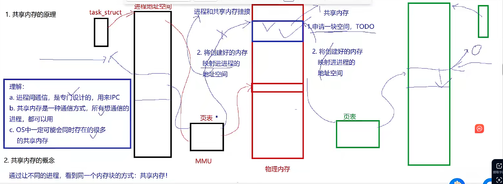
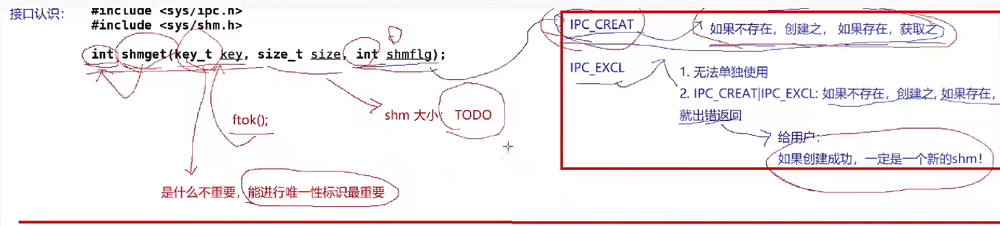
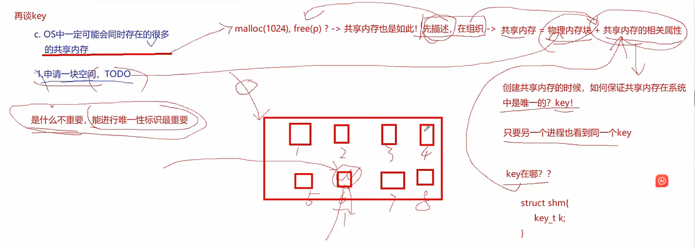
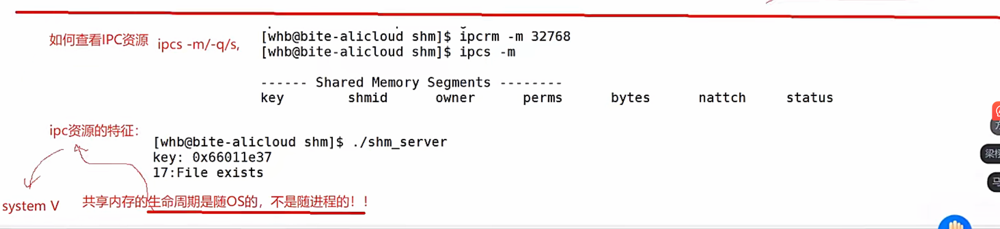
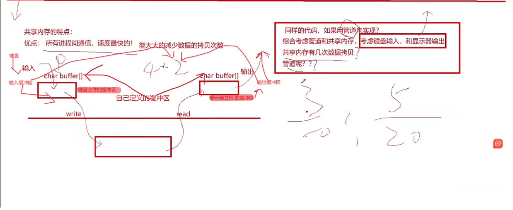
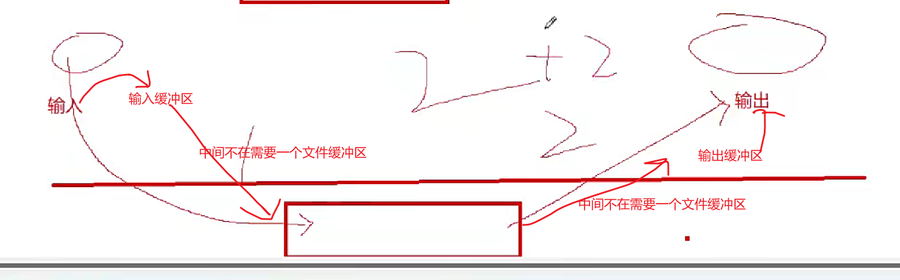

## 共享内存







**ipc资源时一类特殊的系统资源，由操作系统内核提供，用于在两个或多个进程之间传递和共享数据，常见的三种System V IPC资源：消息队列，共享内存，信号量**


```
#include "comm.hpp"
using namespace std;
int main()
{
    key_t k=getKey();
    printf("0x%x\n",k);
    int shmid=getShm(k);
    printf("%d\n",shmid);
    sleep(5);

    //将创建的内存关联到虚拟空间地址/进程
    char*start=(char*)attachshm(shmid);
    printf("attach success,address start:%p\n",start);
    sleep(5);
    const char*message="hello server,我是另一个进程，正在和你通信";
    pid_t id=getpid();
    int cnt=1;
    while(true)
    {
        snprintf(start,Max_Size,"%s[pid:%d][消息编号：%d]",message,id,cnt++);
        sleep(1);
    }
    detachshm(start);
    sleep(5);
    //谁创谁删，不用这个删
    return  0;
}
```

```
#include "comm.hpp"
using namespace std;
int main()
{
    //创建共享内存
    key_t k=getKey();
    printf("0x%x\n",k);
    int shmid=createShm(k);
    printf("%d\n",shmid);
    sleep(5);

    //将创建的内存关联到虚拟空间地址/进程
    char*start=(char*)attachshm(shmid);
    printf("attach success,address start:%p\n",start);


    //使用
    sleep(5);

    while(true)
    {
        //读
        printf("client say: %s\n",start);\
        sleep(1);
    }

    //去关联
    detachshm(start);
    sleep(5);


    //删共享内存
    delshm(shmid);
    return  0;
}
```
```
#ifndef _COMM_HPP_
#define _COMM_HPP

#include<iostream>
#include<sys/ipc.h>
#include<sys/shm.h>
#include<string.h>
#include<cerrno>
#include<cstdlib>
#include<stdio.h>
#include<unistd.h>
#define PATHNAME "."
#define PROJ_ID 0x66
#define Max_Size 4096
using namespace std;
key_t getKey()
{
    key_t k=ftok(PATHNAME,PROJ_ID);
    if(k<0)
    {
        //cin cout cerr-->stdin stdout,stderr-->0 1 2
        cerr<<errno<<": "<<strerror(errno)<<endl;
        exit(1);
    }
    return k;
}
int getShmHelper(key_t k,int flags)
{
    int shmid=shmget(k,Max_Size,flags);
    if(shmid<0)
    {
        cerr<<errno<<": "<<strerror(errno)<<endl;
        exit(2);
    }
    return shmid;
}
int getShm(key_t k)
{
    return getShmHelper(k,IPC_CREAT);
}
int createShm(key_t k)
{
    return getShmHelper(k,IPC_CREAT|IPC_EXCL|0600);
}
void delshm(int shmid)
{
  
    if(shmctl(shmid,IPC_RMID,nullptr)==-1)
    {
        cerr<<errno<<" :"<<strerror(errno)<<endl;
    }
}
void* attachshm(int shmid)
{
    void *mem=shmat(shmid,nullptr,0);
    if((long long)mem==-1L)
    {
        cerr<<errno<<" :"<<strerror(errno)<<endl;
        exit(3);
    }
    return mem;
}
void detachshm(void *start)
{
    if(shmdt(start)==-1)
    {
        cerr<<errno<<" :"<<strerror(errno)<<endl;
        exit(3);
    }
}
#endif
```