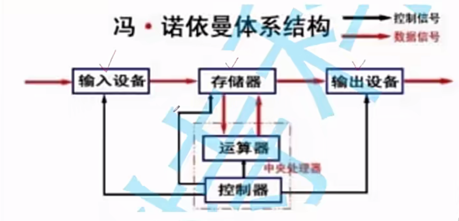

## 冯诺伊曼体系结构

- 这里的存储器是指的内存(掉电易失)，为啥不是磁盘呢，因为磁盘是外设(相对于cpu和内存说的)(外存，永久性存储能力)，是输入输出设备(显卡，网卡···)
- 运算器+控制器+其它=中央处理器(cpu)
- 特点：
    1.cpu其实很笨，但有一个显著的特点，就是：**快**
    2.存储器也就是内存，速度是较快
    3.但对于上面的来说，外设速度就很慢了
- cpu在读取和写入数据的时候，只和内存打交道，提高整机效率。
- 当我们运行程序时，要将硬盘里的数据加载到内存·，但是，加载什么样的数据呢。这时就需要操作系统
- 所以，当开机的时候，需要将操作系统加载到内存，让cpu进行快速执行相应的指令
- 硬盘<--->内存<-->cpu,这里，内存就扮演着大大的缓存的作用
- 存储器和外设交互的过程，也就是我们常说的IO过程
- 所有的外设，有数据要写入和写出时，也一定通过的是内存
- 场景：我们写的代码被编译成二进制可执行程序(cpu有自己的指令集，能够识别)由硬盘加载到内存，再由cpu来执行。
