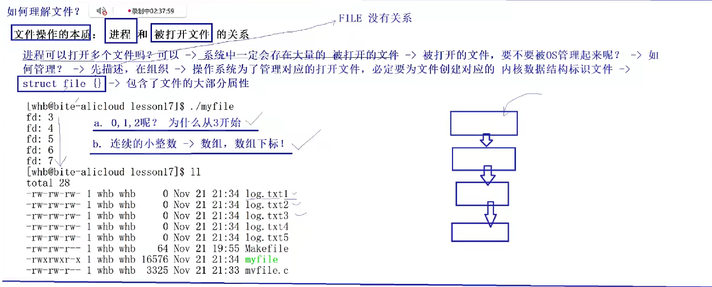
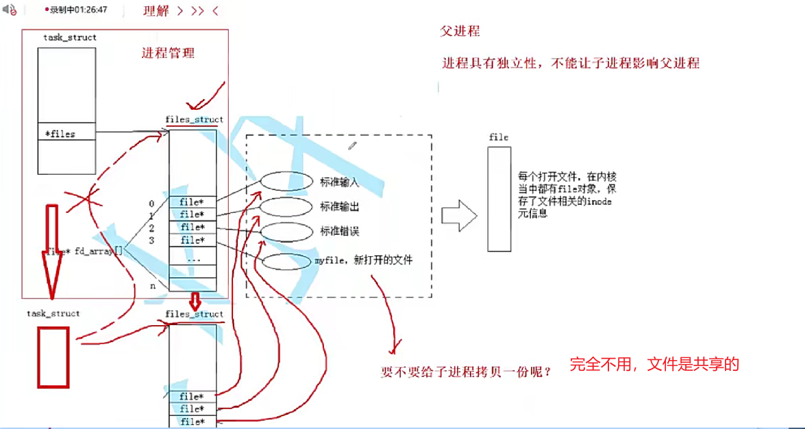

## 基础IO
### 重新谈论文件
1. 空文件，也要在磁盘占用空间
2. 文件=内容+属性
3. 文件操作=对内容+对属性or对内容和属性
4. 标定一个问题，必须使用：文件路径+文件名(唯一性)
5. 如果没有指定对应的文件路径，默认是在当前路径进行文件访问
6. 当我们把fopen等接口写完之后，代码编译之后，形成二进制可执行程序之后，但是没运行，文件对应的操作也就没有被执行---对文件的操作，本质是对进程对文件的操作
7. 一个文件如果被打开，可以进行文件操作吗？不能！一个文件要被访问就必须先被打开(磁盘里的文件有分为被打开的2文件和没有被打开的文件)
8. 所以，文件操作的本质就是进程和被打开文件的关系
### 重新谈论文件操作
1. c语言有文件操作接口，其它语言也有对应的文件操作接口，只不过，它们的操作接口都不一样
2. 文件在哪里-->磁盘-->硬件-->os-->所有人想访问磁盘都绕不过os-->使用os提供的接口-->文件级别的系统调用接口
3. 所以，上层无论如何变化，库函数底层都必须调用系统调用接口

- 文件的操作
```
#include<stdio.h>
#include<unistd.h>
#include<string.h>
#include<sys/stat.h>
#include<fcntl.h>

#define FILE_NAME "log.txt"
int main()
{   

    //开始学点对文件操作的系统接口
    //先看看这些宏：O_RDONLY(只读)  0_WRONLY(只写) O_RDWR(读写)
    //这些宏都对应着一个数，那么为啥要这样弄呢，直接給函数传数值不就可以了吗？
    //当我们想给一个函数传多个数值时，这时不就麻烦了吗，所以每个宏对应的数值，都只有一个比特
    // 位不同，然后在传参数时通过|不就实现了传多个参数的功能了
    umask(0);//清除默认的umask,改变的是子进程的
    // int fd =open(FILE_NAME,O_WRONLY|O_CREAT|O_TRUNC,0666);//得多加o_creat才能文件不存在创建
    //还要写上权限//加上O_TRUNC在w前对文件内容进行清空满足那个细节
    //所以，w--》O_WRONLY|O_CREAT|O_TRUNC,0666
    //a--》O_WRONLY|O_CREAT|O_APPEND,0666
    //r --》说明文件已经存在
    int fd=open(FILE_NAME,O_RDONLY);
    if(fd<0)
    {
        perror("open");
        return 1;
    }

    // int cnt=5;
    // char outBuffer[64];
    // while(cnt)
    // {
    //     sprintf(outBuffer,"%s:%d\n","aaaa",cnt--);
    //     write(fd,outBuffer,strlen(outBuffer));//这里可不用+1，因为字符串结尾加\0是
    //     //c语言的操作，跟我文件可没啥关系，在它看来，都是二进制的代码而已
    // }


    char buffer[1024];
    ssize_t num=read(fd,buffer,sizeof(buffer)-1);//返回读取到的字符个数
    if(num>0)buffer[num]=0;
    printf("%s",buffer);
    close(fd);
    
    
    
    


    //这些都是c对文件操作的接口
    //细节问题：
    //以w打开文件，c会自动清空文件里的内容
    // FILE *fp=fopen(FILE_NAME,"w");//r w r+(读写，不存在出错) w+(读写，不存在创建) a(append)
    // FILE *fp=fopen(FILE_NAME,"r");
    // FILE *fp=fopen(FILE_NAME,"a");
    // if(NULL==fp)
    // {
    //     perror("fopen");
    //     return 1;
    // }
    // char buffer[64];
    // while(fgets(buffer,sizeof(buffer)-1,fp)!=NULL)//读取的是字符串，会在读取的内容后加\0;
    // {
    //     puts(buffer);
    // }
    //fgets会在读取到\n就停止,\n也被读到了或是读到sizeof（buffer）-1个字符就停止
    // int cnt=5;
    // while(cnt)
    // {
    //     fprintf(fp,"%s:%d\n","hello world",cnt--);
    // }
    // fclose(fp);
}
```



- 所以说 C语言的库函数接口不仅要封装系统调用接口还要封装文件描述符


```
#include<stdio.h>
#include<sys/types.h>
#include<sys/stat.h>
#include<fcntl.h>
#include<unistd.h>

int main()
{
    // close(1);
    umask(0);
    int fd=open("log.txt",O_WRONLY|O_CREAT|O_TRUNC,0666);
    if(fd<0)
    {
        perror("open");
        return 1;
    }

    printf("fd:%d\n",fd);
    fprintf(stdout,"open fd:%d\n",fd);
    fflush(stdout);//刷新缓冲区才能打印到log.txt
    close(fd);

    return 0;
}
```


- >:输出重定向
- >>：追加
- <:输入
- 重定向的本质：上层用的fd不变，在内核中更改fd对应的struct file* 的地址

- 以下就是追加重定向
```
#include<stdio.h>
#include<sys/types.h>
#include<sys/stat.h>
#include<fcntl.h>
#include<unistd.h>
#include<string.h>
int main()
{
    // close(1);
    umask(0);
    int fd=open("log.txt",O_WRONLY|O_CREAT|O_APPEND,0666);
    if(fd<0)
    {
        perror("open");
        return 1;
    }
    dup2(fd,1);
    printf("fd:%d\n",fd);
    fprintf(stdout,"open fd:%d\n",fd);

    const char*msg="hello world\n";
    write(1,msg,strlen(msg));
    fflush(stdout);//刷新缓冲区才能打印到log.txt
    close(fd);

    return 0;
}
```

- 一下是输入重定向
```
#include<stdio.h>
#include<sys/types.h>
#include<sys/stat.h>
#include<fcntl.h>
#include<unistd.h>
#include<string.h>
int main()
{
    // close(1);
    umask(0);
    int fd=open("log.txt",O_RDONLY);
    if(fd<0)
    {
        perror("open");
        return 1;
    }
    dup2(fd,0);//输入重定向
    char line[64];
    while(1)
    {
        printf(">");
        if(fgets(line,sizeof(line),stdin)==NULL)break;
        printf("%s",line);
    }
    close(fd);

    return 0;
}
```


执行程序替换的时候，会不会影响曾经进程打开的重定向文件？
- 不会，因为进程程序替换的管理的数据是在用户的空间内，而进程打开的文件管理是在内核数据结构空间里
- 既然文件是共享的，那其中一个进程把文件关了，那另一个进程要用到那个文件时，那该咋办：别担心！！！，文件的struct file里会有一个引用计数，专门记录有多少个进程指向了它，计数为零，操作系统才会释放这个被打开的文件


### 缓冲区
```
#include<stdio.h>
#include<sys/types.h>
#include<sys/stat.h>
#include<fcntl.h>
#include<unistd.h>
#include<string.h>
int main()
{
   printf("hello printf\n");
   fprintf(stdout,"hello fprintf\n");
   fputs("hello fputs\n",stdout);

   const char* msg="hello write\n";
   write(1,msg,strlen(msg));
   fork();

    return 0;
}
```


学到这时，我对AI做出3问：
- 问问关于linux问题：当我们用c式函数打印到stdout，是先到了文件stdout的缓冲区，而这个缓冲区是在File的结构体里，那这个是在用户空间里对吗，还有，如果我用的是系统调用的函数进行打印，是不是就没有所谓缓冲区了呢

1. 关于C标准库函数（如printf）的缓冲区

你的理解是完全正确的。

· 用户空间缓冲区：当我们使用printf、fputs、fprintf等C标准库函数时，数据并不会立即被写入到操作系统或设备中。而是先被写入到一个由C标准库在用户空间维护的缓冲区里。
· FILE结构体：这个缓冲区正是封装在FILE结构体（你在代码中看到的FILE*）内部的。FILE是一个由C标准库定义的结构，它包含了管理文件流所需的所有信息，其中就包括：
  · 指向底层文件描述符（例如，stdout的描述符是1）的指针。
  · 缓冲区的内存地址（char* _IO_buf_base）。
  · 缓冲区的大小。
  · 当前缓冲区的位置指针。
  · 错误和文件结束的标志位。

缓冲策略有三种：

· _IONBF (无缓冲)：数据立即写入，没有缓冲区。stderr默认就是这种模式，确保错误信息能及时输出。
· _IOLBF (行缓冲)：遇到换行符\n时，缓冲区被刷新（内容被写入）。连接到终端(TTY)的stdout默认是这种模式。这也是为什么在命令行中，printf("Hello\n")会立刻看到输出。
· _IOFBF (全缓冲)：只有当缓冲区被填满时，才进行一次写入操作。当stdout被重定向到文件或管道时，默认采用这种模式。这就是为什么有时程序输出到屏幕很快，但重定向到文件后感觉“卡”了的原因。

刷新缓冲区的时机：缓冲区满、遇到换行符（行缓冲模式下）、或者主动调用fflush(stdout)。

---

2. 关于系统调用（如write）的缓冲区

你的说法 “没有所谓缓冲区” 不完全准确。更精确的说法是：系统调用绕过了C标准库的用户空间缓冲区，但仍然会经过内核空间的缓冲区。

当你直接使用系统调用write(STDOUT_FILENO, buf, len)时，会发生以下事情：

1. 跳过用户缓冲区：数据直接从你提供的buf（用户空间）拷贝走，不经过FILE结构体里的那个缓冲区。
2. 进入内核缓冲区：数据通过write系统调用进入内核空间。操作系统内核会为自己管理的I/O设备（如屏幕、磁盘、网卡）维护一套复杂而高效的缓冲区机制（称为“内核缓冲区缓存”）。
   · 这个内核缓冲区的目的是为了减少对物理设备的直接操作次数。设备I/O（尤其是磁盘）是非常慢的操作，集中、批量地读写数据可以极大提升系统整体性能。
3. 最终写入：内核会在未来的某个时刻（根据内核的策略，例如缓冲区满了、或者定时刷新的守护进程flush操作）将缓冲区里的数据真正写入到物理设备（如屏幕的帧缓冲区、磁盘的磁道）。

所以，完整的流程是这样的： 你的程序（用户空间）-> C标准库缓冲区（用户空间） -> write系统调用 -> 内核缓冲区（内核空间） -> 硬件设备

· 使用C标准库函数：走完了整个流程。
· 直接使用write：跳过了第二步，但依然会经过第三步和第四步。

---


- 进程也就是所谓的pcb task-struct是由系统进行组织的，所以task-struct是在内核数据空间里对吗，那么系统调用函数的具体实现也是在内核数据空间里，而c式接口函数的具体实现是在用户空间里吗，尽管会有函数指针指向系统调用函数，还有那个所谓的File*是不是在task-struct定义，然后指向用户空间里的File结构体呢

1. 进程与 task_struct 的位置

你的理解完全正确。

· task_struct 在内核空间：task_struct 是内核用于管理和调度进程的核心数据结构。它包含了进程的一切信息：进程ID、优先级、状态、内存映射、打开的文件列表、信号处理表等。
· 内核维护着一个所有进程的 task_struct 组成的链表（或其他数据结构），以便进行调度。
· 由于内核是系统资源的唯一管理者，这些管理性的数据结构必须存放在受保护的内核数据空间中。用户空间的程序无法直接访问或修改 task_struct，否则会引发严重的安全和稳定性问题。

---

2. 系统调用与C库函数的位置

你的理解基本正确，但需要更精确的表述。

· 系统调用的实现：在内核空间。例如，当你调用 write 系统调用时，你实际上是通过一个“门”从用户空间进入了内核空间。这个“门”通常是一条特殊的CPU指令（如 syscall 或 int 0x80）。一旦通过这扇门，CPU就切换到特权模式，开始执行内核中实现 write 功能的代码。这段代码毫无疑问是在内核空间运行的，因为它需要直接操作硬件和设备驱动。
· C标准库函数的实现：
  · 代码本身：C标准库（如 glibc 或 musl-libc）的代码被编译成共享库（如 /lib/x86_64-linux-gnu/libc.so.6）。当你编译程序时，这些库函数的代码会被映射到你的进程的用户空间地址空间中。所以，当你调用 printf 时，执行的 printf 的指令是位于用户空间的。
  · 函数的行为：printf 这些函数在用户空间执行它们的逻辑，比如解析格式字符串、管理用户空间的缓冲区。但是，当它们需要真正执行I/O操作（比如缓冲区满了需要刷出）时，它们最终会包含或者说发起一个系统调用。这个发起过程，就是通过你提到的“函数指针”或更常见的“软中断”机制，陷入到内核中去。

简单比喻：C库函数像是你的私人助理（在用户空间工作），他帮你处理繁琐的准备工作（格式化、缓冲）。但当他需要实际去银行取钱（操作硬件）时，他必须去银行柜台（系统调用），而银行柜台只有经过授权的银行职员（内核代码）才能进入。

---

3. FILE* 与 task_struct 的关系

这里你的理解需要稍微修正一下，这是最关键也最容易混淆的一点。

· FILE* 和 FILE 结构体在哪？：它们在用户空间。
  · 当你执行 FILE *fp = fopen("file.txt", "r"); 时，fopen 这个C库函数会做两件事：
    1. 它首先会发起一个 open 系统调用，让内核为你打开这个文件。内核会在自己的空间创建一个内核级的 struct file 对象，并将其关联到你的进程的文件描述符表（这个表是 task_struct 的一部分）中，返回一个整数文件描述符 (fd)，比如 3。
    2. 然后，fopen 会在用户空间的堆（heap）上 分配内存，创建一个 FILE 结构体。这个结构体里会存储很多信息，包括：
       · 第一步中获取到的文件描述符 (fd)。
       · 指向用户空间缓冲区的指针。
       · 缓冲区的状态（当前有多少数据、是读是写等）。
       · 其他标志位。
  · 最后，fopen 返回一个指向这个用户空间 FILE 结构体的指针（即 FILE*）。
· task_struct 与 FILE* 的关系：
  · task_struct 根本不直接知道 FILE* 或用户空间的 FILE 结构体的存在。task_struct 是内核的概念，它只管理内核该管的事情。
  · 内核的 task_struct 中有一个成员（通常是 struct files_struct *files），它指向一个文件描述符表。这个表是一个数组，索引就是 0, 1, 2, 3... 这些文件描述符 (fd)，数组的每个元素指向一个内核的 struct file 对象。内核通过这个 fd 来找到真正的文件。
  · FILE* 和它指向的 FILE 结构体，是 C标准库为了方便用户编程而发明的抽象层。它封装了底层的 fd 和自己管理的缓冲区。
  · 所以，关系是：你的程序 -> FILE* (用户空间) -> FILE 结构体 (用户空间，内部包含了fd 3) -> 系统调用 -> 内核通过 task_struct 找到 fd 3 -> 内核的 struct file 对象 -> 真正的硬件/文件。

---
- 我现在自己理清一下你看看对不对：1.task-struct里的struct-files指针指向的struct-file里有文件描述符表，然后这个表记录（下标）记录的信息是会返回给c函数在用户空间里创建的File结构体的2.假设现在父进程里有系统调用的函数也有c调用的函数，这些函数父进程执行往后再fork 注意是输出重定向到某个文件中，这里的c调用的函数要打印的内容因为有File所以子进程会拷贝（虚拟空间地址）所以c式调用的函数打印的内容最终会打印两次，系统调用的函数因为在内核空间里所以子进程没拷贝所以进程退出后也只打印一次，这样理解对吗

1. 关于 task_struct 和文件描述符表的关系

你的第一点基本正确：

· task_struct 是内核中的进程控制块，其中包含一个指向 struct files_struct 的指针（通常名为 files）。
· struct files_struct 中有一个文件描述符表（通常是一个数组，索引就是文件描述符编号，如 0、1、2 等）。
· 每个文件描述符（fd）对应一个内核中的 struct file 对象，该对象管理打开文件的真实状态（如文件偏移量、访问模式等）。
· 当C标准库函数（如 fopen）被调用时，它会先通过系统调用（如 open）获取一个文件描述符（fd），然后在用户空间的堆上分配一个 FILE 结构体，并将这个 fd 存储在其中（例如 FILE 结构体中的 _fileno 字段）。所以，是的，文件描述符表中的下标（fd）会返回给C函数，并保存在用户空间的 FILE 结构体中。

2. 关于 fork 和输出重定向的行为

你的第二点关于 fork 后输出行为的理解，大致方向对，但需要更精确的解释：

· 输出重定向到文件：当程序将输出重定向到文件时（例如使用 > 在 shell 中重定向），C标准库通常会对 stdout 使用全缓冲（fully buffered）模式，而不是默认的行缓冲（line buffered）。这意味着输出数据会先存储在用户空间的缓冲区中（在 FILE 结构体内），直到缓冲区满或显式调用 fflush 或程序结束。
· fork 的行为：fork() 系统调用会创建一个子进程，它会复制父进程的整个用户空间虚拟地址空间，包括用户空间的 FILE 结构体和其缓冲区。但是，文件描述符表也会被复制——子进程获得父进程文件描述符表的副本，这意味着父子进程共享相同的文件描述符编号，并指向相同的内核 struct file 对象。因此，文件偏移量等状态是共享的。
· C标准库函数（如 printf）：如果父进程在调用 fork 之前已经执行了一些 printf 调用，但数据还在用户空间缓冲区中（未刷新），那么子进程也会拥有这个缓冲区的副本。当父进程和子进程最终退出时（或调用 fflush），它们都会刷新自己的缓冲区，导致数据被写入文件两次。这就是为什么你可能会看到输出重复。
· 系统调用函数（如 write）：如果父进程直接使用 write 系统调用，数据会立即被写入内核缓冲区（绕过用户空间缓冲区）。由于 write 是直接操作文件描述符，并且内核缓冲区不会被 fork 复制，所以数据不会因为 fork 而重复。但是，注意：如果父子进程都调用 write，它们可能会共享文件偏移量，导致输出交错（但不会因为缓冲而重复）。通常，write 调用是原子性的（对于小量数据），所以交错可能不明显，但重复不会发生。

纠正一个常见误解

· 系统调用在内核空间，但数据不会“不被复制”：fork 不会复制内核空间的数据（如内核缓冲区），但系统调用（如 write）本身是在 fork 之前发生的，所以数据已经进入内核缓冲区，子进程不会重复这些数据。如果 write 是在 fork 之后调用，那么父子进程都会执行 write，各自写入数据，但这取决于代码逻辑，不是缓冲的问题。

示例场景

假设有以下代码：

```c
#include <stdio.h>
#include <unistd.h>

int main() {
    printf("Hello from C printf\n");  // 用户空间缓冲，未刷新
    write(STDOUT_FILENO, "Hello from write\n", 17);  // 直接系统调用
    fork();
    return 0;
}
```

· 如果输出重定向到文件，可能输出：
  · "Hello from write" 一次（因为 write 立即生效）。
  · "Hello from C printf" 两次（因为 fork 复制了缓冲区，子进程和父进程都刷新缓冲区）。
· 但如果输出到终端（行缓冲），printf 可能会立即刷新，避免重复。


### 理解文件系统
- 上面我们所说的都是进程与被打开的文件的关系，但是，系统里有那么多的文件，那没有被打开的文件又该怎么办呢？
- 磁盘上面有大量的文件，也是必须要被静态管理起来，方便我们随时打开--文件系统
#### 补充知识：存储
1. 磁盘物理结构
- 磁盘是一个机械结构+外设=硬盘访问会很慢

2. 磁盘的存储结构


- 虽然磁道的周长不一样，但存储的大小是一样的
- 磁头==面数 磁头是共进退的
- 在磁盘中怎么定位一个扇区呢：1.先定位哪一个磁道(柱面)，在定位磁头(盘面)，最后在定位哪一个扇区--》chs(定位法：英文字母首个拼接的)

3. 磁盘的逻辑结构

- 磁盘物理上是圆形，逻辑上应抽象为线性结构

- 为什么os要进行逻辑抽象呢，直接用chs不行吗？
：1.便于管理 2. 不想让os的代码和硬件强耦合
- 假设磁盘有500G的大小，那怎么管理呢？：采用分治的思想，把500G分为5个100，再把100分为···，直到分为了最基本的大小如5GB
- 现在知道了，磁盘空间是通过分区分组进行管理的，那对于文件来说是怎么进行管理的呢？


- 当要删除一个文件的时候，首先通过在innode table里找到inode->对应的inode bitmap的那个比特位置为0，通过innode将对应的block_bitmap的比特位置为0。
- 所以，如果误删了，此时最好的做法是：啥都不做，不然用了数据块有可能把那个删除的文件对应的数据块给覆盖了
- 不过还有疑问：那目录的数据块放什么呢，以及文件名在哪？答案：目录的数据块放的就是文件名和inode的映射(一个文件下不能放两个相同的文件)
### 软硬链接

### 动静态库

- 这里关于代码的问题就不写了：1.动静态库各自的生成 2.各自的链接(动静态链接)
- 但需要强调一下程序执行的问题：静态链接生成的程序你可以直接./运行，但动态链接的就不行，你还要告诉系统动态库的位置，告诉的方法具体就不展开了
- 动静态库的加载
1. 对静态库来说，当我们链接形成可执行程序的时候，就已经将静态库的方式实现加载到了程序的代码段，这也就决定了未来这部分代码，必须通过相对确定的地址位置来进行访问(这也就是为什么我们执行程序的时候不需要再指明静态库的位置，因为源程序的代码段已经有对应函数的实现)
2. 对动态库来说，首先，我们链接生成可执行程序的时候，可不是将数据库拷贝到了程序的代码段，而是将偏移地址写到了我们程序里，当程序运行的时候，这些偏移地址也就映射到了虚拟空间地址的代码段，而操作系统也需要去找动态库，将动态库加载到内存中，再将它映射到了虚拟空间地址的共享区，最终，通过共享区和代码段中的偏移量也就找到了具体函数的实现。这时又意思的也就出来了：当有100个程序运行的时候，我们也只是需要将加载到内存的一份动态库通过页表映射到需要的进程的虚拟空间地址中。