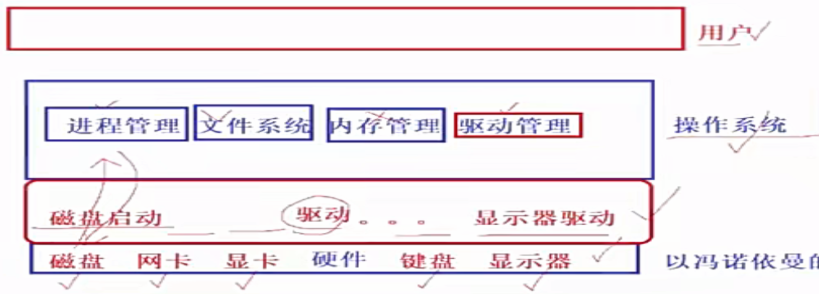
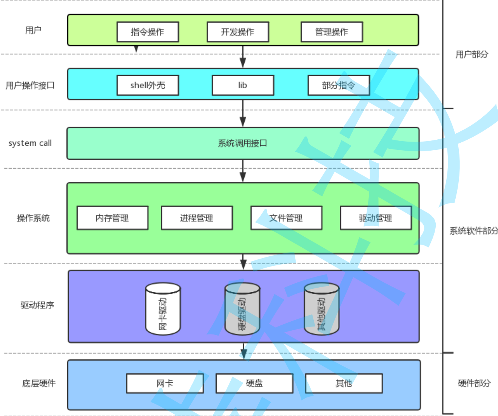

## 操作系统

**本质**：是一个进行软硬件资源管理的软件，通过管理好软硬件资源，为用户提供一个安全，稳定，高效的运行环境。

- 当开机把操作系统和相应的硬件驱动加载到内存时，就会有这样的结构，最下面是以冯诺伊曼体系的硬件联系结构，它们通过相应的驱动与操作系统建立交互。
- 操作系统在这个结构上扮演着管理的作用，那么，管理的本质是管理数据，管理的方法是**先描述再组织**。
- 这里的组织需要强调下，是怎样组织的呢，对于内存中的代码和数据，操作系统会将它们建成链表等类型的数据结构从而方便管理(这里的解释有点粗糙，因为涉及到了进程相关的知识)

- 这就是完整的体系结构
- 可以看到，操作系统设置了与外界访问的接口，也就是c式的接口(os通过c语言提供的函数调用)
- 为啥提供了这样的小窗口，原因是既满足了用户的操作，也保护了系统，但是，用户仅仅依靠这样的小窗口是远远不够的，那该怎么办。
- 所以，如上所见，再系统调用接口上面还有用户操作接口，使得用户的指令能够及时进行执行