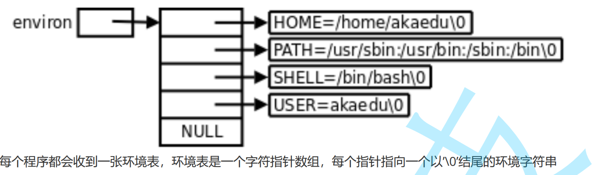

## 环境变量
1. 什么是环境变量
- 环境变量(environment variables)一般是指在操作系统中用来指定操作系统运行环境的一些参数
- 如：我们在编写C/C++代码的时候，在链接的时候，从不知道我们的所链接的动态静态库在哪里，但是照样可以链接成功，生成可执行程序，原因就是有相关环境变量帮助编译器进行查找。
- 环境变量通常具有某些特殊用途，还有在系统当中通常具有全局特性

2. 常见环境变量
- PATH : 指定命令的搜索路径 
- HOME : 指定用户的主工作目录(即用户登陆到Linux系统中时,默认的目录)
- SHELL : 当前Shell,它的值通常是/bin/bash.

>这里就可以提出疑问了，操作系统是怎么知道我是谁的呢?
>
>原因就是，环境变量具有全局属性，HOME是指定用户的主工作目录，那么，他首先要找到当前用户是谁，PATH变量下就动态存储着当前用户的名字
>
>当我们运行ls时显示当前目录下的文件，但是，他也需要找到当前是在什么路径下的，当我们执行ls时，可以说内存里就有了它的进程，而这个进程的父进程是bash(系统进程)，而环境变量具有全局性，会被子进程给继承了，所以，ls的进程就找到了pwd，从而能够找到当前目录。
>
>myval=1234567;本地变量，只会在当前进程bash有效
3. 查看环境变量
- echo $NAME //NAME:你的环境变量名称

4. 为什么要执行hello程序时，不能像ls那样，直接ls而要./hello？
- 因为，hello不在环境变量PATH下,系统不能自动找到它，得给它提供位置
- 如果要想执行它不用提供路径，可以将当前路径先添加到PATH下
- 添加方法：export PATH=$PATH:hello的路径，前面PATH=$PATH不能省略,不然hello会直接覆盖掉之前的路径导致我们的其它系统命令执行不了了。


5. 与环境变量相关的命令
- echo: 显示某个环境变量值
- export: 设置一个新的环境变量
- env: 显示所有环境变量
- unset: 清除环境变量
- set: 显示本地定义的shell变量和环境变量
6. 环境变量的组织方式

7. 通过代码获取环境变量
    1. 通过第三个参数
    ```
    #include <stdio.h>

    int main(int argc, char *argv[], char *env[])
    {
    int i = 0;
    for(; env[i]; i++){
    printf("%s\n", env[i]);
    }
    return 0;
    }
    ```
    >在这个代码中，第一个参数存储的是参数的个数，第二个参数(指针数组)存储的是传进来各个选项(字符串)，第三个参数就是环境变量

    2. 使用getenv()
    ```
     
    #include <stdio.h>
    #include <stdlib.h>

    int main()
    {
    printf("%s\n", getenv("PATH"));
    return 0;
    }
    ```
    3. 使用第三方变量environ
    ```
    #include<stdio.h>
    int main(int argc, char *argv[])
    {
        extern char **environ;
        int i = 0;
        for(; environ[i]; i++){
        printf("%s\n", environ[i]);
        }
        return 0;
    }   
    ```
8. 环境变量通常具有全局属性的，可以被子进程继承下来
```
#include <stdio.h>
#include <stdlib.h>
 
int main()
{
 char * env = getenv("MYENV");
 if(env){
 printf("%s\n", env);
 }
 return 0;
}
```
直接查看，发现没有结果，说明该环境变量根本不存在,但是，当在命令行下执行export MYENV="hello world"，这时候就能输出结果了。**因为编写的代码的可执行程序的该进程是bash的子进程，所以，它继承了该环境变量，最终能够输出结果**