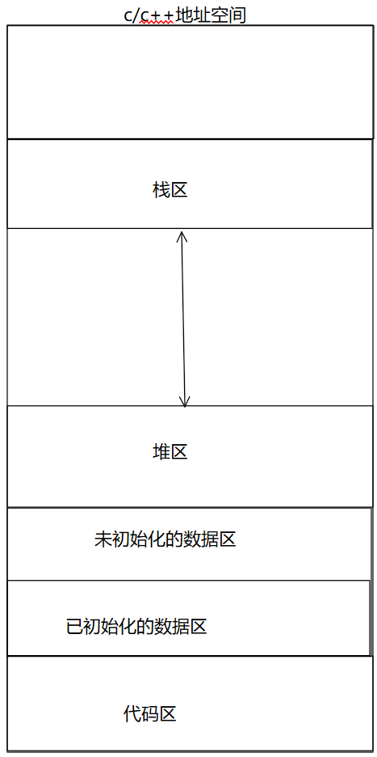

# 进程地址空间

## 什么是进程地址空间？
1. 我们先来看看这段代码
```
#include <stdio.h>
#include <unistd.h>
#include <stdlib.h>
 
int g_val = 0;
 
int main()
{
    pid_t id = fork();
    if(id < 0){
    perror("fork");
    return 0;
    }
    else if(id == 0){ //child,子进程肯定先跑完，也就是子进程先修改，完成之后，父进程再读取
    g_val=100;
    printf("child[%d]: %d : %p\n", getpid(), g_val, &g_val);
    }else{ //parent
    sleep(3);
    printf("parent[%d]: %d : %p\n", getpid(), g_val, &g_val);
    }
    sleep(1);
    return 0;
}
```
输出的结果为：
>child[3046]: 100 : 0x80497e8
>
>parent[3045]: 0 : 0x80497e8
- 首先，其实父进程和子进程的g_val的值不一样我们其实可以理解，因为进程间是相对独立的，但是，**为啥同一个地址空间，最终，它们的值确却是不相同的**
- 我们可以明显得出来这样一个结论：**该地址一定不是物理地址**
- 之前学到这的时候，总有疑问：虚拟空间的地址是一样的，这是为啥？-- 这其实应该是跟fork创建子进程的方式有关

2. 我们先来看看我们之前学c语言一直画的地址空间：



提出疑问：在这幅图上，所画的地址空间是在物理内存上吗？
- **对于上述的疑问，可以统一做出回答，它们都不在物理内存上，它们在虚拟地址上**

3.感性理解虚拟地址空间
- 有一个大富翁(10个亿)，有三个儿子，对于这三个儿子(它们彼此都不知道对方的存在)，富翁都对它们说等它死后就给他继承十个亿的资产，在平时的时候，富翁都会给他们需要的钱，但儿子们不能直接索要这十个亿，而富翁却给他们每个人都画了大饼。
- 在这个过程中，儿子就是进程，富翁就是内存/操作系统，给每个儿子画的大饼就是进程空间地址(虚拟空间地址)。
- 富翁要是儿子多了，画的大饼也就多了，儿子(进程)要被管理,那饼也要被管理-->先描述再组织
- 所以，地址空间的本质就是内核的一种数据结构mm_struct(来描述上面那张图)

- 可以看出，其实就是通过起始地址和终止地址来划分出不同的区域，栈区和堆区所谓的区域调整，也不过是改变各个区域的start和end
- 基础知识：
    1. 地址空间描述的基本空间大小是字节
    2. 32位下->2^32次方个地址
    3. 2^32*1个字节=4G空间范围
    4. 每一个字节都要有唯一的地址
- 综上，其实第一幅图所描述的C/C++地址空间其实就是进程地址空间，里面的地址也就是每个进程里指针所指向的虚拟空间地址。
- 现在我们来描述以下一个程序的运行：
    1. 首先，一个可执行程序由硬盘加载到内存
    2. 然后，内存里产生一个进程控制模块，在进程控制模块里通过指针来找到加载到内存里的可执行程序(编写的代码程序)
    3. 作为每一个进程来说，它们都以为自己独享内存空间，因为操作系统给它们画了张大饼，进程指向的代码程序里的变量被存储的空间其实并不是在实际的物理空间地址，而是在进程空间地址上(虚拟空间)，然后通过页表来映射到实际的物理空间地址。

## 为什么要存在进程地址空间(虚拟地址)

1. 如果让进程直接访问物理内存，万一进程越界非法操作呢，那就非常不安全
    - 那用存在进程地址空间就可以增加安全吗？答案：是的！因为页表不仅仅是映射，还具有"拦截"功能，即只会映射到安全的物理空间地址

2.地址空间的存在，可以更方便的进行进程和进程的数据代码的解耦，保证进程独立性这样的特征

    - 当子进程要改变glo_val的值是，一开始，它们映射到物理内存地址是一样的，但是，如果子进程修改就会影响父进程的，这就违背了进程的独立性。
    - 所以，操作系统就会进行写时拷贝，即先进行数据拷贝，更改页表映射，再让进程进行修改


    
3. 让进程以统一的视角，来看待进程对应的代码和数据等各个区域，方便使用编译器也以统一的视角来进行编译代码

    - 再来提出一个非常非常严肃的问题：当我们生成的可执行程序还没加载到内存时，这时候，程序有地址吗？

    - **有**,但还没加载到内存时，编译器会给程序的代码区和数据区分配地址，但这地址叫做逻辑地址。(在x32环境下，通常就是0-xxx来分配的区域，而在x64环境下，是通过0和地址偏移量来找的)
    - 所以，对于虚拟地址空间，我们不能天然以为只有os会遵守对应的规则，编译器也会遵守，编译器在把我们的代码编译成可执行程序时，会按照虚拟地址空间的方式进行对我们的代码数据进行编址的(为啥没对栈区和堆区进行编址，因为它们是变化的)。
    - 当程序被加载到物理内存中时，该程序对应的指令和数据，都天然的具有了物理地址，而程序内部的逻辑地址在被加载到内存时，也转化为了对应进程的虚拟地址。
    - 因此， 当cpu对内存里的进程运行时，通过进程找到虚拟地址，再通过虚拟地址找到实际物理空间地址(页表)，也就是说，cpu不直接和实际物理空间地址打交道

