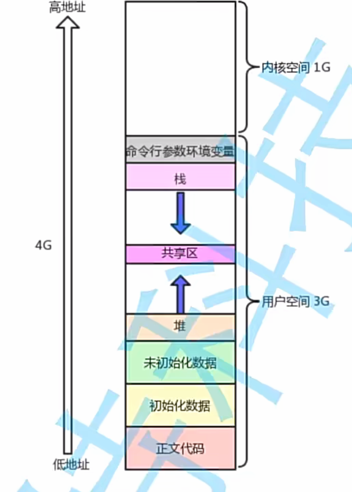
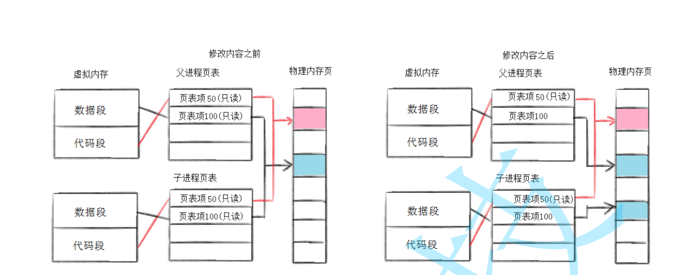
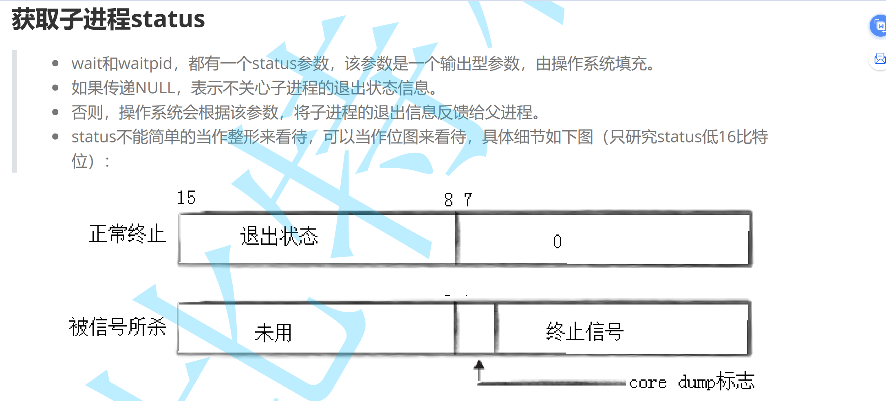
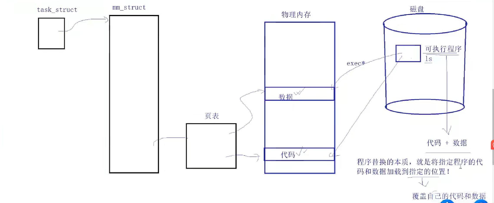
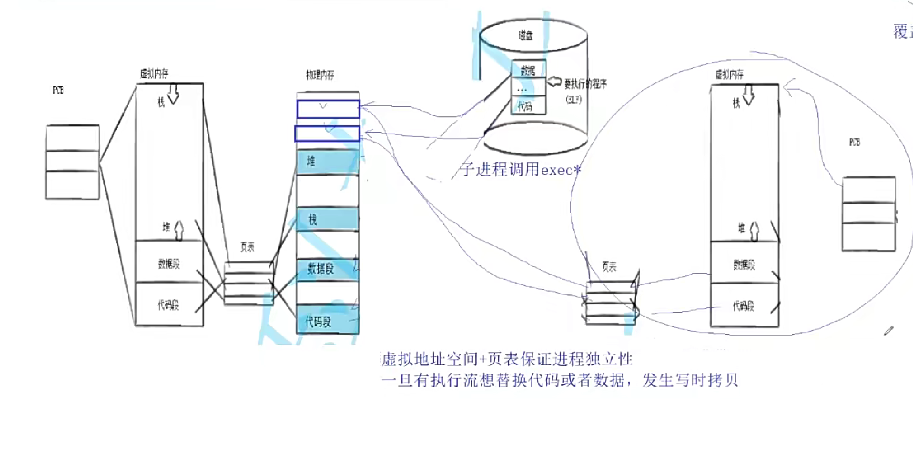

## 进程控制
### fork
经过之前的学习，对于fork会有以下疑问：
1. 如何理解fork函数有两个返回值？
2. 如何理解fork返回之后，给父进程返回子进程pid，给子进程返回0？
3. 如何理解同一个id值，怎么可能会保存两个不同的值，让if else if同时执行？
- 首先，我们要清楚知道，父进程：子进程=1：n，所以对于子进程来说，父进程是唯一的，所以给子进程返回父进程的pid，它们直接通过getppid就找到了，但是，给父进程就得返回子进程的pid，不然找不到子进程，因为父进程的子进程有多个    
- 要理解fork函数的执行：
    1. 首先，fork()在用户空间上被调用，而fork()的实现是在存在操作系统的内核空间上，fork函数内：1.先创建子进程的pcb，2. 赋值，3. 创建子进程的地址空间，4. 赋值 5. 创建并设置页表 6. 子进程放入进程的运行队列中，7.~~~~~          return pid;
    2. 需要值得注意的是，在return 之前，fork函数的核心功能已经执行完了，所以在fork函数return之前，子进程就已经存在了并可能已经在cpu的运行的队列中了
    3. 那么，子进程和父进程享同一份代码空间，谁先返回pid也是都有可能的(return之前，子进程就已经存在了),fork函数有两个返回值，这时也就可能发生写时拷贝，这时我们就看到了，同一个id，地址(每一个进程对应的虚拟空间地址)是一样的，但它们的值(虚拟空间地址映射的实际内存空间地址)却是不一样的




4. 所以，fork之前父进程独立执行，fork之后，父子两个执行流分别执行。注意，fork之后，谁先执行完全由调度器
决定。
5. fork创建子进程失败的原因：
    - 系统中有太多的进程
    - 实际用户的进程数超过了限制
### 进程终止
1. 进程退出场景 
    - 代码运行完毕，结果正确
    - 代码运行完毕，结果不正确
    - 代码异常终止

2. 进程退出码
    - 进程退出的时候，对应的退出码，用来标定进程执行的结果是否正确
    - echo $? 永远记录最近一个进程在命令中执行完毕时对应的退出码(main->return ?;)
    - 意义：让父进程知道子进程的运行结果，其中0：success,!0:标识失败，!0具体是几来标识不同的错误
    - 如何设定main函数的返回值呢吗，首先，如果不关心进程退出码，就直接返回0就可以，反之关心的话就要返回特定的数字表明特定的错误
    - 一般而言，退出码都必须要有对应的文字描述，1.可以使用自定义 2. 可以使用系统的映射关系
    - print("%d:%s\n",sterror(i));
    - 当代码异常终止时，退出码无意义
3. 进程退出的方式
    - main函数return返回
    - 任意地方调用 exit(code)
    - _exit()
    - 区别：1. exit终止进程，主动刷新缓冲区，而_exit不会；2. exit是库函数，在用户空间内，而_exit是系统调用函数；3. exit内部也是通过调用了exit(),由此也可看出缓冲区是在用户空间里
    ```
    #include <unistd.h>
    void _exit(int status);
    参数：status 定义了进程的终止状态，父进程通过wait来获取该值说明：虽然status是int，但是仅有低8位可以被父进程所用。所以_exit(-1)时，在终端执行$?发现返回值是255。
    exit最后也会调用_exit, 但在调用_exit之前，还做了其他工作：
    1. 执行用户通过 atexit或on_exit定义的清理函数。
    2. 关闭所有打开的流，所有的缓存数据均被写入
    3. 调用_exit
    实例：
    
    #include <unistd.h>
    void exit(int status);
    ```
### 进程等待
- Z:僵尸状态(子进程退出，父进程不管不顾)
- 父进程派给子进程的任务完成的如何，我们需要知道，所以，父进程通过进程等待的方式，回收子进程资源，获取子进程退出信息
- 进程等待的方式：
1. wait
```
#include<sys/types.h>
#include<sys/wait.h>
 
pid_t wait(int*status);
 
返回值：
 成功返回被等待进程pid，失败返回-1。
参数：
 输出型参数，获取子进程退出状态,不关心则可以设置成为NULL
 ```
 2. waitpid
 ```
  
#include<sys/types.h>
#include<sys/wait.h>
 
pid_t wait(int*status);
 
返回值：
 成功返回被等待进程pid，失败返回-1。
参数：
 输出型参数，获取子进程退出状态,不关心则可以设置成为NULL
pid_ t waitpid(pid_t pid, int *status, int options);
返回值：
 当正常返回的时候waitpid返回收集到的子进程的进程ID；
 如果设置了选项WNOHANG,而调用中waitpid发现没有已退出的子进程可收集,则返回0；
 如果调用中出错,则返回-1,这时errno会被设置成相应的值以指示错误所在；
参数：
 pid：
 Pid=-1,等待任一个子进程。与wait等效。
 Pid>0.等待其进程ID与pid相等的子进程。
 status:
 WIFEXITED(status): 若为正常终止子进程返回的状态，则为真。（查看进程是否是正常退出）
 WEXITSTATUS(status): 若WIFEXITED非零，提取子进程退出码。（查看进程的退出码）
 options:
 WNOHANG: 若pid指定的子进程没有结束，则waitpid()函数返回0，不予以等待。若正常结束，则返回该子进
程的ID。
```
注意：
- 如果子进程已经退出，调用wait/waitpid时，wait/waitpid会立即返回，并且释放资源，获得子进程退
出信息。
- 如果在任意时刻调用wait/waitpid，子进程存在且正常运行，则进程可能阻塞。
- 如果不存在该子进程，则立即出错返回。
- 当子进程退出时，将进程退出码和信号保留在pcb中，而父进程通过等待将这些信息保留在status，检测子进程退出信息，实际就是将子进程退出信息通过status拿回来

- printf("child exit code:%d\n", (st>>8)&0XFF);
- printf("sig code : %d\n", st&0X7F );
>信号是啥：通过kill 来查看
>退出码是啥：return exit()
>当程序正常运行的话，信号是0，当异常时信号非0，此时的退出码是无意义的
- 阻塞式等待与非阻塞式等待
    1. 场景模拟：打电话时，一直不挂电话；打电话，打上了，但电话里的人说还没准备好。
    2. 在这个场景中，打电话的人就是父进程，接电话的人就是子进程，打电话这个动作就是系统调用wait/waitpid,一直不挂就是阻塞式等待，另一种就是非阻塞式等待。
    3. 
    ```
    阻塞式等待pid_t ret=waitpid(id,&status,0);
    非阻塞式等待
    pid_t ret=waitpid(id,&status,WNOHANG);
    if(ret==0)
    {
        //waitpid调用成功&&子进程没退出
        //子进程没有退出，waitpid没有等待失败，仅仅是监测到了子进程没有退出
        //这里可以做一些其它任务
    }
    else if(ret>0)
    {
        //waitpid调用成功&&子进程退出了

    }
    else if(ret=-1)
    {
        //waitpid调用失败
        //怎么调用失败？
        //举例：pid_t ret=waitpid(id+1,&status,WNOHANG);
    }
    ```
    4. 非阻塞式等待好处：不用占用父进程的所有精力，可以在轮询期间干干别的
    5.不同：
        - wait只能等待任意一个子进程，不能指定特定的子进程。(阻塞式)
        - waitpid可以通过`pid`参数指定要等待的子进程，也可以等待一组子进程。(可以调整等待方式)
### 进程程序替换
- 创建子进程的目的：
    1. 想让子进程执行父进程代码的一部分
    2. 想让子进程执行一个全新的程序
- 相关函数：(作用：将指定的程序加载到内存中，让指定进程进行执行)
    1. int execl(const char*path,const char*arg,...);
        1. 第一个参数解决了找到的问题，第二个参数解决了如何执行的问题
        2. 三个点是可变参数列表的意思
        3. 只要是函数调用就可能会失败(例如找不到你要替换的程序)，所以execl失败了就会有返回值
        4. 为啥没有成功的返回值呢·，因为如果成功了就被替换了，有返回值也没有意义
        5. l:list:将参数一个一个的传入exec*
    2. int execlp(const char*file,const char*arg,...)
        1. p:path:不用告诉程序的路径，只要告诉我程序名，会自动在环境变量path进行程序的查找
    3. int execv(const char*path,char*const arg);
        1. v:vector:将变量统一通过数组传过去。
    4. int execvp(const char*file,char*const arg);
    5. int execle(const char* path,const char*arg,...,char*const envp[]);
        1. e:自定义环境变量(最后一个参数)
        2. 但其实你也可以传系统环境变量environ,不过就算你不传，子进程自己也可以获取
        3. 那我就想把系统环境变量和自定义的环境变量一起传进去，就可以用putenv把自定义的导入到系统上，再来传environ参数
    6. execve是系统调用，上面的函数都是基于此的封装，是为了让我们有更多的选择
    **现在，需要对这类函数有更深刻的看法，一开始，我们想的是通过让子进程调用这类函数从而执行了在硬盘里的另一个程序，那么，exec类函数也就是实现了将程序加载到内存的功能**

    **那我们在bash上./程序就调用执行了这个程序，这个过程是不是也执行了加载的功能，非常明显·，这是当然的，所以，bash也调用了exec类函数实现了将程序加载到内存的功能，同时exec上的参数如char*arg,或是环境变量(不传的话子进程照样能拿到默认的环境变量，environ，通过地址空间的方式让子进程拿到的)也就传到了main函数上**

- 原理

    
    **所以,进程替换的时候，并没有创建新的进程**
    
    但是，当创建子进程进行程序替换的时候，就不会直接将代码和数据进行替换了，而是要进行写时拷贝，不影响父进程的运行。

    

- shell的模拟实现
```
#include<stdio.h>
#include <string.h>
#include<stdlib.h>
#include <time.h>
#include<unistd.h>
#include<sys/types.h>
#include<sys/wait.h>
#include<assert.h>

#define NUM 1024
#define OPT_NUM 64
char lineCommand[NUM];
char* myargv[OPT_NUM];
int main()
{
    while(1)
    {
    printf("用户名@主机名 当前路径#");
    fflush(stdout);
    char*s =fgets(lineCommand,sizeof(lineCommand)-1,stdin);
    assert(s!=NULL);
    (void)s;
    lineCommand[strlen(lineCommand)-1]=0;
    myargv[0]=strtok(lineCommand," ");
    int i=1;
    while(myargv[i++]=strtok(NULL," "));
#ifdef DEBUGa
    for(int i=0;myargv[i];i++)
    {
        printf("myargv[%d]:%s\n",i,myargv[i]);
    }
#endif
    pid_t id=fork();
    assert(id!=-1);
    if(id==0)
    {
        execvp(myargv[0],myargv);
        exit(1);
    }
    waitpid(id,NULL,0);
    }
}
```
>对于这段代码，我们可以简单执行ls这类操作，但是，如果我们执行cd命令，，再来执行pwd查看当前目录，我们发现始终是在当前目录，也就是cd没有切换当前的目录，那么我们应该怎么办呢？
- 首先，解释原因：当我们执行程序时，程序进程就有了，然后，程序进程通过调用fork生成子进程来执行命令，可是子进程执行完命令就没了啊！！！，如果是ls这种，子进程执行完后我们还能看到，但是，子进程就算执行完命令切换了路径，但是这里的**路径是子进程的工作路径，而不是父进程的，每个进程都有自己的工作路径，我们平时cd切换的路径是bash进程的,而子进程执行完就没了，所以我们看不到**
- 通过ls 程序名/程序的进程号————>可以查看进程的相关信息
    1. cwd：当前进程的工作目录
    2. exe：当前进程执行的是磁盘路径下的哪个文件
**这里需要强调一下，因为是模拟bash，所以我们的程序进程模拟的就是bash，创建的子进程就是我们之前的程序进程**
```
char lineCommand[NUM];
char* myargv[OPT_NUM];
int main()
{
    while(1)
    {
    printf("用户名@主机名 当前路径#");
    fflush(stdout);
    char*s =fgets(lineCommand,sizeof(lineCommand)-1,stdin);
    assert(s!=NULL);
    (void)s;
    lineCommand[strlen(lineCommand)-1]=0;
    myargv[0]=strtok(lineCommand," ");
    int i=1;
    while(myargv[i++]=strtok(NULL," "));
    //如果是cd命令，不需要shell自己执行对应的命令，本质就是执行系统接口
    //像这种不需要让我们的子进程来执行，而是让shell自己执行的命令————内建/内置命令
    if(myargv[0]!=NULL&&strcmp(myargv[0],"cd")==0)
    {
        if(myargv[1]!=NULL)chdir(myargv[1]);
        continue;
    }
#ifdef DEBUGa
    for(int i=0;myargv[i];i++)
    {
        printf("myargv[%d]:%s\n",i,myargv[i]);
    }
#endif
    pid_t id=fork();
    assert(id!=-1);
    if(id==0)
    {
        execvp(myargv[0],myargv);
        exit(1);
    }
    waitpid(id,NULL,0);
    }
}
```
    
