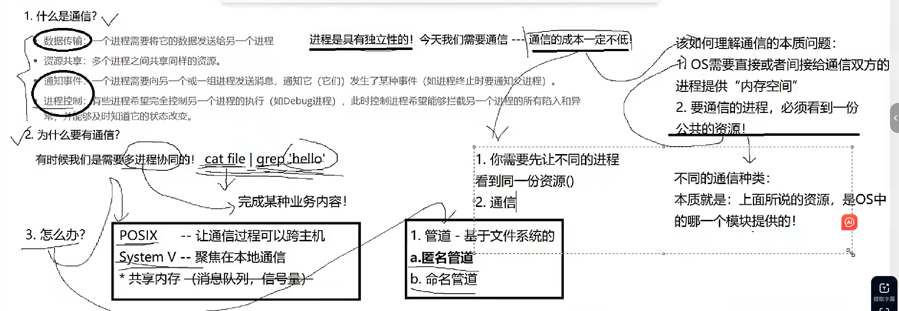
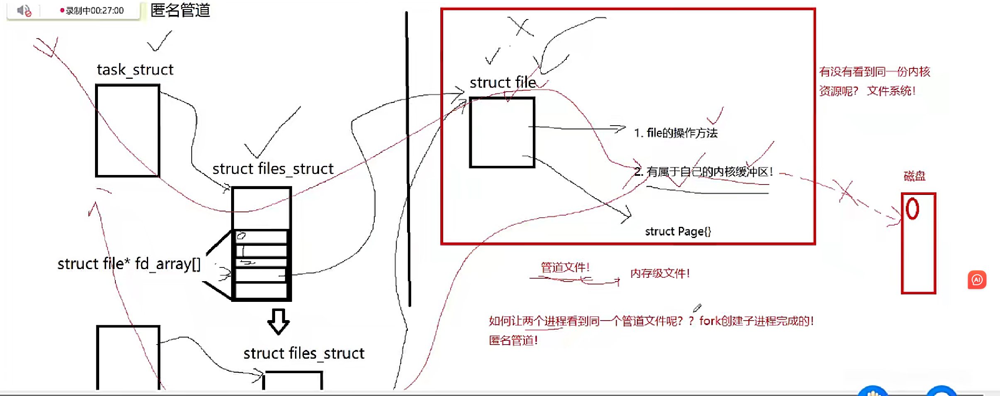
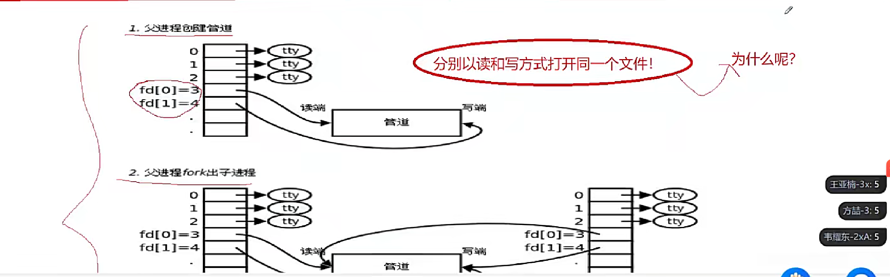
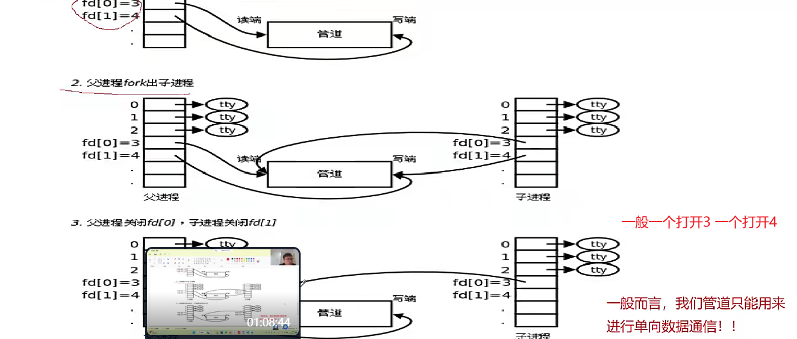

## 进程间通信
- 为什么要有通信：有时候我们要进行多进程协同：cat file | grep 'hello'
- 怎么办：
    1. 管道
    2. 标准：POSIX(让通信过程可以跨主机)，System V(聚焦在本地通信)


- 我们之前都是从硬盘加载文件到内存(打开)，然后在系统内核空间内产生一个struct file，所谓的io也就是用户调用了write相关的方法，让进程通过struct file找到具体的操作指针，调用具体文件系统的写入函数，写入到内核的缓冲区···。
在这个过程中的struct file是操作系统生成的，那也就是说不一定要通过磁盘加载文件才会产生struct file



### 匿名管道
- 对于这里的缓冲区，我们要有些清晰认识：之前的io也就是基于磁盘打开的文件，这里的缓冲区是系统创建的页缓冲，这是全局共享的，所有进程访问同一文件都能看到这部分，但我们肯定不能基于这个特点来用来通信，因为进程A用户缓冲区--内核页缓存--磁盘控制器缓存区--磁盘写入
进程B用户缓冲区--内核页缓存--磁盘控制器缓存区--磁盘写入，一次交互就要拷贝这么多次了
- 管道文件，系统就会专门开辟有关的进程间通信缓冲区，这部分是由struct file里的指针所指向的，这是局部专用的，每个管道都有自己的缓冲区  进程A用户缓冲区--管道文件缓存--进程B用户缓冲区


- 所以，匿名管道可以用来父子进程间通信

```
#include<iostream>
#include<cassert>
#include<unistd.h>
#include<sys/wait.h>
#include<sys/types.h>
#include<cstring>
#include<cstdio>
using namespace std;

int main()
{
    //父进程进行读取，子进程进行写入 
    //第一步：创建管道文件，打开读写端
    int fds[2];
    int n=pipe(fds);
    assert(n==0);
    //第二步：fork
    pid_t id=fork();
    assert(id>=0);
    if(id==0)
    {
        //子进程进行写入
        close(fds[0]);
        //子进程的通信代码
        const char* s="我是子进程，正在给你发信息";
        int cnt=0;
        while(true)
        {
            cnt++;
            char buffer[1024];
            snprintf(buffer,sizeof(buffer),"child->parent say: %s[%d][%d]",s,cnt,getpid());
            write(fds[1],buffer,strlen(buffer));
            sleep(1);//每隔一秒写
            //如果这时子进程一直写，父进程一直不读，怎么办
            //写端写满时，在写会阻塞，等对方进行读取
            //这里如果不写sleep，那如果子进程写太快了，父进程读一次的时候就不是那么短
            //就会一次性读最多1023 
        }

        //子进程
        close(fds[1]);
        exit(0);
    }
    //父进程进行读取
    close(fds[1]);

    //父进程的通信代码
    while(true)
    {
        char buffer[1024];
        //如果子进程不是sleep(1)而是sleep好久，那么父进程在read这里怎么办呢
        //如果管道中没有了数据，读端在读，默认会直接阻塞当前正在读取的进程
        ssize_t s=read(fds[0],buffer,sizeof(buffer)-1);
        if(s>0)
        {
            buffer[s]=0;
            cout<<"Get Message# "<<buffer<<"|my pid: "<<getpid()<<endl;
        }
        else if(s==0)
        {
            //读到文件结尾
            //即子进程把写端关了
            cout<<"read:"<<s<<endl;
            break;
        }
        //父进程没有sleep

    }


    n=waitpid(id,nullptr,0);
    assert(n==id);
    close(fds[0]);


    //[0]:读[1]:写
    // cout<<"fds[0]: "<<fds[0]<<endl;
    // cout<<"fds[1]: "<<fds[1]<<endl;
    // std::cout<<"hello"<<std::endl;
    return 0;
}
```

- 读写特征：
1. 读慢，写快
2. 读快，写慢
3. 写关，读0
4. 读关，os会给子进程发送信号，终止写端


---

### 实名管道
- 命名管道是如何让不同进程看到同一份资源？
- 答案：它可以让不同进程打开指定名称(路径＋文件名)的同一个文件
- 可是普通文件也是可以的啊
- 所以，这就是它的特殊性所在，普通文件被一个进程写入数据时就会io即刷新到硬盘上，但命名管道不会，写入的数据还在内核空间中，所以，其它进程也能看到。

```
#include "comm.hpp"

using namespace std;
int main()
{
    int wfd=open(NAME_PIPE,O_WRONLY);
    if(wfd<0)exit(1);
    //write
    char buffer[1024];
    while(true)
    {
        cout<<"Please say# ";
        fgets(buffer,sizeof(buffer),stdin);//abcd\n
        if(strlen(buffer)>0)buffer[strlen(buffer)-1]=0;
        ssize_t n=write(wfd,buffer,strlen(buffer));
        assert(n==strlen(buffer));
        (void)n;
    }
    close(wfd);
    return 0;
}
```

```
#include "comm.hpp"
using namespace std;
int main()
{
    bool r=createFifo(NAME_PIPE);
    assert(r);//debug 才有  release就没了
    (void)r;//因为release下没了assert，为了防止因为r报错

    int rfd=open(NAME_PIPE,O_RDONLY);
    if(rfd<0)exit(1);
    //read
    char buffer[1024];
    while(true)
    {
        ssize_t s=read(rfd,buffer,sizeof(buffer)-1);
        if(s>0)
        {
            buffer[s]=0;
            cout<<"clint->serve# "<<buffer<<endl;
        }
        else if(s==0)
        {
            cout<<"client quit,me too "<<endl;
            break;
        }
        else{
            cout<<"err string "<<strerror(errno)<<endl;
            break;
        }
    }
    close(rfd);

    removeFifo(NAME_PIPE);
    return 0;
}
```

```
#pragma once
#include<iostream>
#include<sys/types.h>
#include<sys/stat.h>
#include<fcntl.h>
#include<cerrno>
#include<cstring>
#include<cassert>
#include<unistd.h>

using namespace std;

#define NAME_PIPE "./mypipe"

bool createFifo(const string& path)
{
    umask(0);
    int n=mkfifo(path.c_str(),0600);
    if(n==0)
    return true;
    else{
        cout<<"error: "<<errno<<"err string"<<strerror(errno)<<endl;
        return false;
    }
}
void removeFifo(const string &path)
{
    int n=unlink(path.c_str());
    assert(n==0);
    (void)n;
}

```